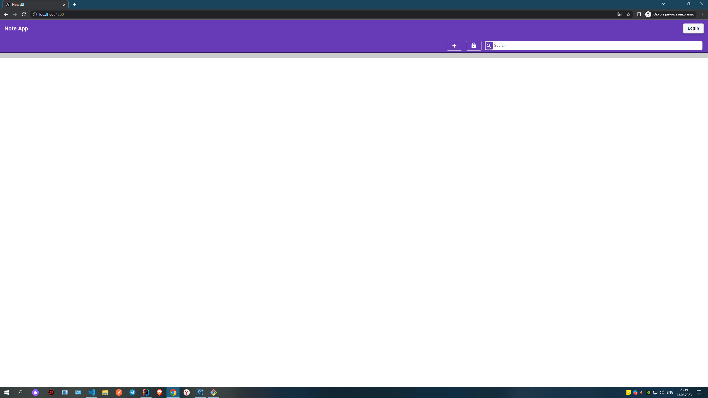
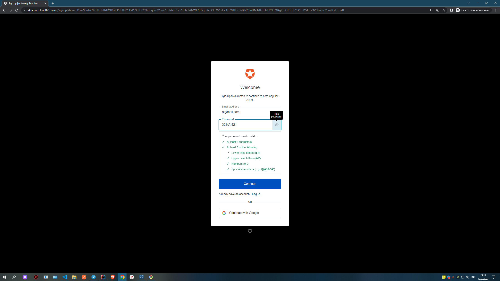
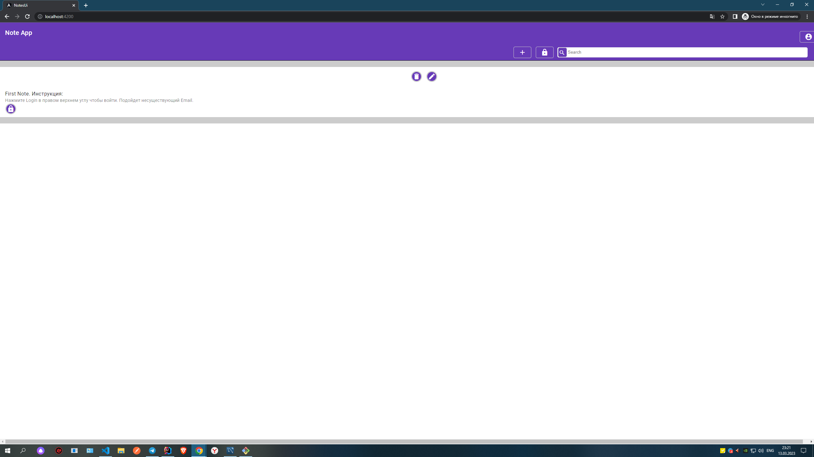
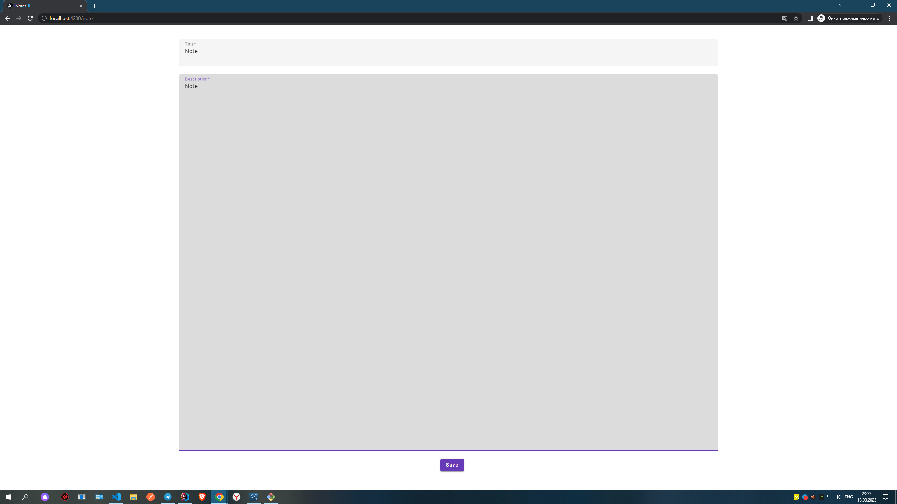
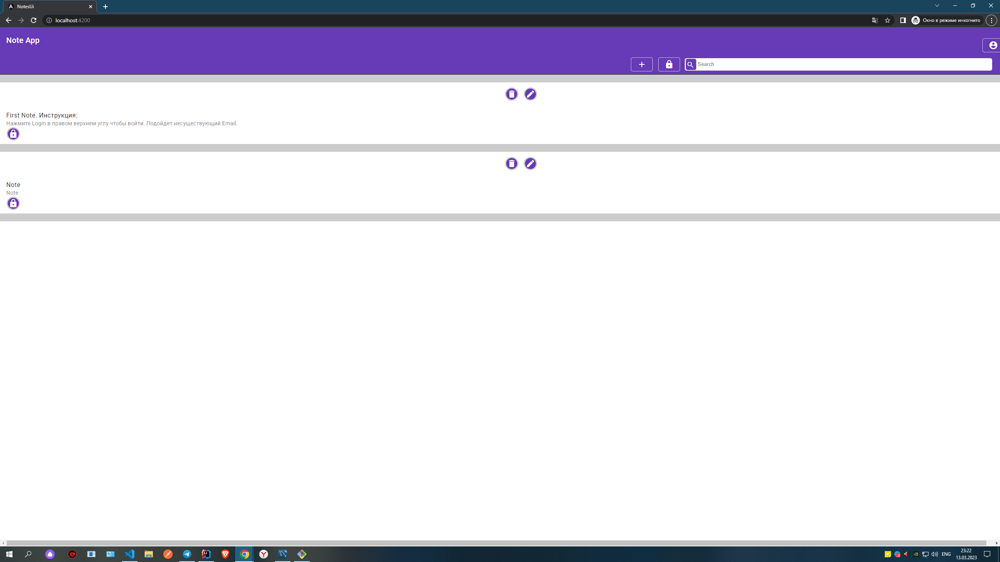

##Требования:
__Необходимо создать приложение Заметки на одном из следующих языков
программирования, выбирай который больше всего предпочитаешь:__
* Oracle PL/SQL
* Pascal(Delphi)
* Java
* JS
* Kotlin
* С#
* С++
* 1С 

__Приложение может быть сделано как в консольном виде, так и в браузере или в виде
приложения на Android, iOS.
Строгих требований к реализации и функциональности нет, будь творческим! Нам
главное посмотреть, как ты подходишь к задаче и какие инструменты в разработке
используешь.__

__Обязательные требования:__

1. Создание одной простейшей заметки только с текстом.
2. Редактирование заметки в окне собственного приложения.
3. Сохранение заметки между сеансами приложения, в любом формате.
4. При первом запуске, приложение должно иметь одну заметку с текстом.

__Желательно:__
1.  Создание нескольких заметок в приложении.
2.  Выводить список существующих заметок.
3.  Возможность редактирования любой заметки из списка.
4.  Удаление заметок.
5.  Также сохранять все заметки между сеансами.

__Идеи для улучшения:__

1. Возможность выделять текст курсивом, жирным и т.п.
2. Менять шрифт и раз.

##Работа веб-приложения:

* __До того как создать заметкку нужно авторизоваться в приложении нажав на кнопку в правом верхнем углу. Это не составит труда, регистрация проходит быстро Email можно вписать несуществующий и подобрать пароль который проходит валидацию.__ 

* __После авторизации смело отпраляйте запросы.__

* __Также после авторизации мы можем увидеть первую автоматически заполненную заметку.__

* __Теперь посе того как мы вошли можем смело отправлять запросы__

  
